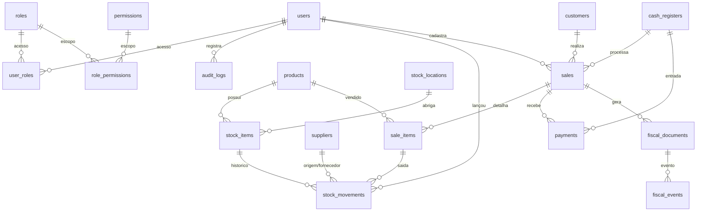

# Modelo de Banco de Dados do PDV

## 1. Diagrama ER


## 2. Modelo lógico (tabelas iniciais)
- **usuarios (`users`)**: autenticação e trilhas (`email`, `full_name`, `hashed_password`, `is_active`, `is_superuser`, `created_at`).
- **perfis (`roles`)** e **permissoes (`permissions`)**: controle de acesso via tabelas de junção `user_roles` e `role_permissions`.
- **produtos (`products`)**: SKU, nome, descrição, preço/custo e flag de ativo; estoque por local em `stock_items`.
- **estoque_movimentacoes (`stock_movements`)**: mudanças de quantidade por item/locação com tipo (`entry/exit/adjustment`), motivo, fornecedor opcional, vínculo ao item de venda, usuário que lançou e carimbo de data.
- **clientes (`customers`)** e **fornecedores (`suppliers`)**: cadastro básico com documento, contato e data de criação.
- **caixas (`cash_registers`)**: código único, status, valores de abertura/fechamento, horários e usuários responsáveis.
- **vendas (cabeçalho `sales`)**: código, status, totais/descontos, cliente, operador e caixa vinculado.
- **vendas_itens (`sale_items`)**: produto, quantidade, preço unitário/total e relação com movimentações de estoque.
- **pagamentos (`payments`)**: método, valor, código de transação, status de pago, datas e caixa associado.
- **documentos_fiscais (`fiscal_documents`)** e **eventos**: modelo (NFC-e/SAT/MFE), protocolo, chave de acesso, status e histórico em `fiscal_events`.
- **auditoria (`audit_logs`)**: ações, entidade, payload, usuário e data.

## 3. Código SQL/SQLAlchemy
Os modelos SQLAlchemy estão em `backend/app/models/` e cobrem todas as entidades acima. Trechos principais em SQL para referência:
```sql
CREATE TABLE suppliers (
    id SERIAL PRIMARY KEY,
    name TEXT NOT NULL,
    document TEXT,
    phone TEXT,
    email TEXT,
    contact_name TEXT,
    created_at TIMESTAMP
);

CREATE TABLE cash_registers (
    id SERIAL PRIMARY KEY,
    code TEXT UNIQUE NOT NULL,
    status TEXT,
    opening_amount NUMERIC(12,2) DEFAULT 0,
    closing_amount NUMERIC(12,2),
    opened_at TIMESTAMP,
    closed_at TIMESTAMP,
    opened_by_id INTEGER REFERENCES users(id),
    closed_by_id INTEGER REFERENCES users(id)
);

ALTER TABLE sales ADD COLUMN cash_register_id INTEGER REFERENCES cash_registers(id);
ALTER TABLE payments ADD COLUMN cash_register_id INTEGER REFERENCES cash_registers(id);

ALTER TABLE stock_movements
    ADD COLUMN movement_type TEXT NOT NULL DEFAULT 'adjustment',
    ADD COLUMN supplier_id INTEGER REFERENCES suppliers(id) ON DELETE SET NULL,
    ADD COLUMN sale_item_id INTEGER REFERENCES sale_items(id),
    ADD COLUMN created_by_id INTEGER REFERENCES users(id);
```

## 4. Migrações Alembic
- `0001_initial.py`: cria a estrutura base (usuários, permissões, produtos, estoque, vendas, pagamentos e fiscal).
- `0002_pdv_core_entities.py`: adiciona fornecedores, caixas, vínculos de caixa em vendas/pagamentos e novos metadados em `stock_movements`.

Execute `alembic upgrade head` no diretório `backend/` para aplicar todo o modelo lógico ao banco de dados.
